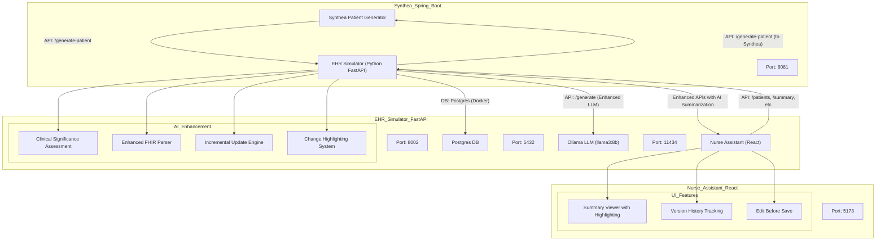

# Healthcare Simulation Platform with Enhanced AI Summarization

This platform consists of three main projects/services working together to provide sophisticated healthcare simulation with AI-powered clinical summarization:

- **Synthea Spring Boot** (Patient Generator)
- **EHR Simulator** (Python FastAPI backend with Enhanced LLM Integration)
- **Nurse Assistant** (React frontend)

All services are designed to work together to simulate patient data, store and process FHIR bundles, and provide a modern clinical UI with advanced AI-powered incremental summarization.

---

## 🧠 Enhanced AI Summarization System

### Key Features

- **🌡️ Temperature = 0**: Deterministic, reproducible results for clinical accuracy
- **🔄 Incremental Updates**: Intelligent updates that preserve existing recommendations
- **📊 Clinical Significance Assessment**: Automatic evaluation of when modifications are warranted
- **🎯 Evidence-Based Changes**: Only modifies recommendations when clinically justified
- **📝 Professional Clinical Documentation**: Maintains medical documentation standards
- **🔍 Enhanced FHIR Parsing**: Detailed extraction of clinical information

### LLM Configuration

```python
LLM_CONFIG = {
    "temperature": 0.0,      # Maximum reproducibility and accuracy
    "top_p": 1.0,           # Deterministic sampling
    "repeat_penalty": 1.1,   # Avoid repetition
    "top_k": 1,             # Most deterministic setting
    "timeout": 120.0        # Extended timeout for complex prompts
}
```

### Clinical Significance Scoring

The system automatically assesses the clinical significance of new data:

- **Critical Indicators** (Score +3): `critical`, `emergent`, `urgent`, `deteriorating`, `unstable`
- **Significant Indicators** (Score +2): `new diagnosis`, `medication change`, `treatment response`
- **Routine Indicators** (Score -1): `stable`, `unchanged`, `routine`, `maintenance`

**Thresholds:**
- **≥5**: Major modifications warranted
- **≥2**: Moderate modifications appropriate  
- **≥0**: Minimal modifications needed
- **<0**: Routine update only

### Summary Types

1. **Historical Summaries**: Comprehensive overviews of patient medical history
2. **Current Summaries**: Incremental updates that build upon previous versions with intelligent change detection

---

## System Architecture



---

## 🔧 Enhanced API Endpoints

### EHR Simulator (FastAPI, Port 8002)

#### Core Patient Management
- `POST /admit-patient` - Admit a new patient (calls Synthea)
- `GET /patients` - List all patients
- `GET /patients/{id}` - Get full FHIR bundle for a patient
- `GET /events/{id}` - Simulated patient events (SSE)

#### Advanced AI Summarization APIs
- `POST /patients/{id}/summarize` - **Enhanced**: Generate summary with clinical significance assessment
  ```json
  {
    "summary_type": "current|historical"
  }
  ```
  **Response includes:**
  - Generated summary text
  - HTML with highlighted changes
  - Clinical significance assessment
  - Previous summary comparison

- `GET /patients/{id}/summary` - Get latest active summaries
  **Response:**
  ```json
  {
    "historical": {
      "content": "...",
      "highlighted_html": "...",
      "version": 1,
      "created_at": "..."
    },
    "current": {
      "content": "...",
      "highlighted_html": "...",
      "version": 2,
      "created_at": "..."
    }
  }
  ```

- `POST /patients/{id}/summary` - Save edited summary
  ```json
  {
    "type": "current|historical",
    "content": "...",
    "highlighted_html": "..."
  }
  ```

- `GET /patients/{id}/summary/{type}/history` - Get complete version history

---

## 🎯 AI Summarization Workflow

### 1. Data Extraction and Processing
```python
# Enhanced FHIR parsing extracts:
# - Demographics (name, gender, DOB)
# - Conditions with clinical status and onset
# - Medications with dosage and status  
# - Vital signs and lab results (categorized)
# - Encounters and procedures with dates
# - Allergies with criticality levels
# - Care plans with status and intent
```

### 2. Clinical Significance Assessment
```python
def assess_clinical_significance(previous_summary: str, new_data: str) -> str:
    # Analyzes keywords and context to determine:
    # - Critical changes requiring immediate attention
    # - Significant changes warranting care plan updates
    # - Routine changes for monitoring purposes
    # Returns scored assessment with guidance
```

### 3. Intelligent Incremental Updates
```python
# LLM receives:
# 1. Previous clinical summary (foundation)
# 2. New patient data (structured)
# 3. Clinical significance assessment (guidance)
# 4. Specific instructions for preservation vs. modification

# LLM outputs:
# - Complete updated summary maintaining continuity
# - Only evidence-based modifications
# - Professional clinical documentation format
```

### 4. Change Highlighting and Version Control
```python
def highlight_changes(old_text: str, new_text: str) -> str:
    # Sentence-based diff for clinical readability
    # HTML highlighting with CSS classes
    # Preserves clinical document structure
```

---

## 📋 Enhanced Features

### Reproducible Results
- **Temperature = 0.0**: Ensures identical outputs for same inputs
- **Deterministic Sampling**: Consistent behavior across runs
- **Clinical Accuracy**: Reliable for healthcare documentation

### Intelligent Decision Making
- **Preserves Continuity**: Maintains existing assessments and care plans
- **Evidence-Based Updates**: Only modifies when clinically justified
- **Professional Standards**: Follows medical documentation best practices

### Advanced UI Integration
- **Real-time Highlighting**: Visual indication of new/changed content
- **Edit Functionality**: Nurses can review and edit before saving
- **Version History**: Complete audit trail with timestamps
- **Professional Interface**: Material-UI components for clinical workflows

---

## 🚀 Quickstart

### Prerequisites
- Docker (for Postgres)
- Python 3.9+ with virtual environment
- Node.js 16+ and npm
- Java 11+ (for Synthea)
- Ollama with llama3:8b model

### Setup Steps

1. **Start Postgres** (Docker)
   ```bash
   docker run --name postgres-ehr -e POSTGRES_PASSWORD=postgres -p 5432:5432 -d postgres
   ```

2. **Start Ollama** with llama3:8b model
   ```bash
   ollama serve  # Port 11434
   ollama pull llama3:8b
   ```

3. **Start Synthea** (Spring Boot, port 8081)
   ```bash
   cd synthea
   ./gradlew bootRun
   ```

4. **Start EHR Simulator** (Enhanced FastAPI, port 8002)
   ```bash
   cd ehrsimulator
   source ehrsimulator-venv/bin/activate
   python start_server.py
   ```

5. **Start Nurse Assistant** (React, port 5173)
   ```bash
   cd nurseassistant
   npm install
   npm run dev
   ```

### Testing the Enhanced AI System

```bash
# Test reproducible summarization
curl -X POST http://localhost:8002/patients/1/summarize \
  -H "Content-Type: application/json" \
  -d '{"summary_type": "current"}'

# Test clinical significance assessment
curl -X POST http://localhost:8002/patients/1/summarize \
  -H "Content-Type: application/json" \
  -d '{"summary_type": "current"}' | jq .

# Generate historical overview
curl -X POST http://localhost:8002/patients/1/summarize \
  -H "Content-Type: application/json" \
  -d '{"summary_type": "historical"}'
```

---

## 📊 Technical Specifications

### Database Schema
```sql
-- Enhanced patient summaries table
CREATE TABLE patient_summaries (
    id SERIAL PRIMARY KEY,
    patient_id INTEGER REFERENCES patients(id),
    summary_type VARCHAR NOT NULL,  -- 'historical' or 'current'
    content TEXT NOT NULL,
    version INTEGER NOT NULL,
    is_active BOOLEAN DEFAULT TRUE,
    created_at TIMESTAMP DEFAULT NOW(),
    changes_highlighted TEXT  -- HTML with highlighted changes
);
```

### Configuration Options
```python
# Customizable thresholds for clinical decision-making
CLINICAL_SIGNIFICANCE = {
    "critical_threshold": 5,    # Major modifications warranted
    "significant_threshold": 2, # Moderate modifications appropriate
    "routine_threshold": 0      # Minimal modifications needed
}

# LLM behavior control
LLM_CONFIG = {
    "temperature": 0.0,         # Reproducibility (0.0-1.0)
    "top_p": 1.0,              # Deterministic sampling
    "repeat_penalty": 1.1,      # Repetition control
    "top_k": 1,                # Token selection
    "timeout": 120.0           # Request timeout
}
```

---

## 🏥 Clinical Workflow Integration

### For Healthcare Professionals

1. **Patient Admission**: Generate new patient with comprehensive FHIR data
2. **Initial Assessment**: Create historical summary from complete medical record
3. **Ongoing Care**: Generate incremental current summaries that build upon previous versions
4. **Review Process**: Edit generated summaries before saving to ensure clinical accuracy
5. **Documentation**: Maintain complete version history with highlighted changes
6. **Handoffs**: Use highlighted summaries to quickly identify recent changes

### Quality Assurance Features

- **Deterministic Output**: Same inputs always produce identical results
- **Clinical Validation**: Automatic assessment of change significance
- **Human Review**: Edit capability before final documentation
- **Audit Trail**: Complete version history with timestamps
- **Professional Standards**: Maintains medical documentation format

---

## 🔍 Monitoring and Validation

### System Health Checks
```bash
# Verify all services are running
curl http://localhost:8081/actuator/health  # Synthea
curl http://localhost:8002/patients         # EHR Simulator  
curl http://localhost:5173                  # Nurse Assistant
curl http://localhost:11434/api/tags        # Ollama
```

### AI System Validation
```bash
# Test reproducibility (should return identical results)
for i in {1..3}; do
  curl -s -X POST http://localhost:8002/patients/1/summarize \
    -H "Content-Type: application/json" \
    -d '{"summary_type": "current"}' | jq -r .summary | head -3
done
```

---

## 📚 Additional Resources

- [Synthea Documentation](https://synthetichealth.github.io/synthea/)
- [FHIR R4 Specification](https://hl7.org/fhir/R4/)
- [Ollama Documentation](https://ollama.ai/docs)
- [FastAPI Documentation](https://fastapi.tiangolo.com/)
- [React Documentation](https://react.dev/)

---

## 🤝 Contributing

This platform demonstrates advanced healthcare simulation with production-ready AI summarization capabilities. The enhanced LLM system provides:

- **Clinical Accuracy**: Temperature=0 for reproducible results
- **Intelligent Updates**: Evidence-based incremental summarization  
- **Professional Integration**: Ready for healthcare workflows
- **Quality Assurance**: Built-in validation and review processes

For questions or contributions, please refer to the individual project documentation in each subdirectory. 